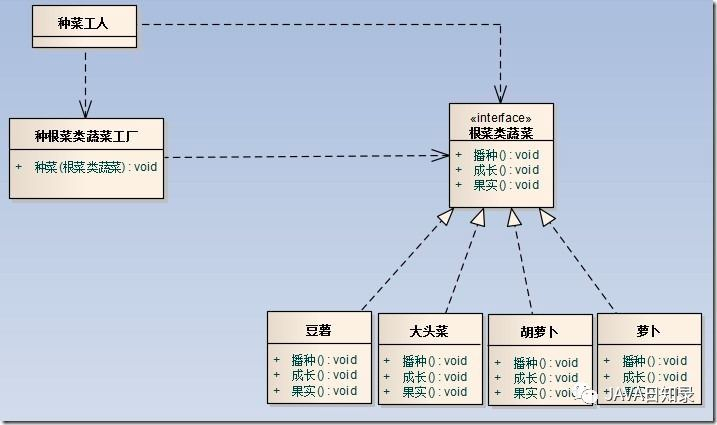
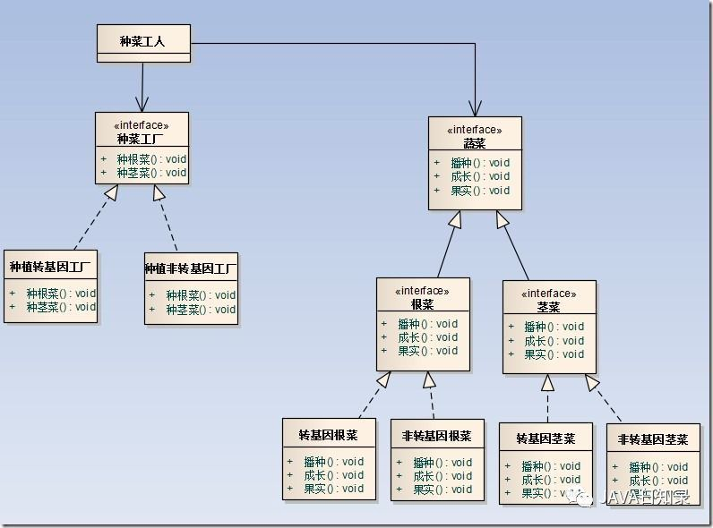

首先来看看两者的定义区别：

* 工厂模式 定义一个用于创建对象的接口，让子类决定实例化哪一个类
* 抽象工厂模式 为创建一组相关或相互依赖的对象提供一个接口，而且无需指定他们的具体类

个人觉得这个区别在于产品，如果产品单一，最合适用工厂模式，但是如果有多个业务品种、业务分类时，通过抽象工厂模式产生需要的对象是一种非常好的解决方式。 再通俗深化理解下：工厂模式针对的是一个产品等级结构 ，抽象工厂模式针对的是面向多个产品等级结构的。

再来看看工厂方法模式与抽象工厂模式对比：

| 工厂方法模式 | 抽象工厂模式 |
| -----------| ---------- |
| 针对的是单个产品等级结构 | 针对的是面向多个产品等级结构 |
| 一个抽象产品类 | 多个抽象产品类 |
| 可以派生出多个具体产品类 | 每个抽象产品类可以派生出多个具体产品类 |
| 一个抽象工厂类，可以派生出多个具体工厂类 | 一个抽象工厂类，可以派生出多个具体工厂类 |
| 每个具体工厂类只能创建一个具体产品类的实例 | 每个具体工厂类可以创建多个具体产品类的实例 |

举个例子说明下 用种蔬菜的例子来说明事实，最初的时候，由于规模小，只种植一种蔬菜，根菜类蔬菜，这个时候由于种植方式比较简单，采用简单工厂模式即可，主要目的是让工人轻松，下达工厂种植即可；

随着种植厂的发展以及市场的需求，要增加一种蔬菜类型种植了，茎菜，由于茎菜与根菜种植方式不一致，就需要两个专门的种植工厂来进行管理，那么此时就采用工厂模式来管理，一个工厂负责一种作物的种植，这个时候产品可以理解为仍然在一个层次。

但是随着科技的发展，我们逐步要种植转基因与非转基因食品了，在以前的蔬菜种类上又增加了一个层次，这个时候无法将其作为一个层次来解决，所以必须采用抽象工厂的方式来解决。

可以从UML图很明显的看出来，抽象工厂可以创建多个产品类对象，如在种菜工厂中，有种根菜，种茎菜。

工厂模式与抽象工厂模式以及简单工厂模式只有在具体应用的时候，分析具体的产品层级，然后选择相应的设计模式。

而在每一个层次，种菜工人所关心的对象也不一样，在简单工厂模式下，工人要想到种植萝卜还是白菜，在工厂模式下，工人想到是种植根菜还是茎菜，而在抽象工厂模式下，则关心种植基因菜还是非基因菜。