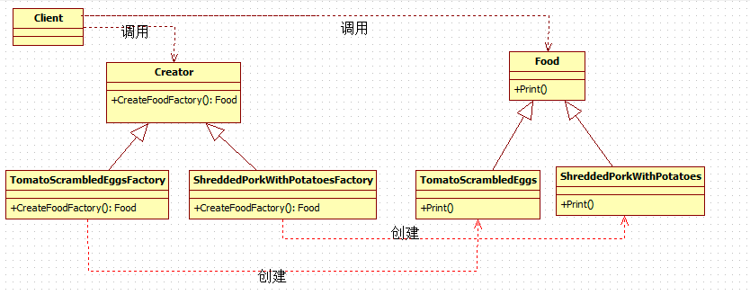

# What is Factory Method Design Pattern?
According to Gang of Four Definition **'Define an interface for creating an object, but let the subclasses decide which class to instantiate. The Factory method lets a class defer instantiation it uses to subclasses'**
# Implementing the Factory Method Design Pattern in C#:
* Step1: Creating Product Interface (CreditCard)
* Step2: Creating Concrete Products (ConcreteProducts: Platinum, Titanium)
* Step3: Creating Abstract Creator (CreditCardFactory)
* Step4: Creating Concrete Creator (ConcreteCreator: PlatinumFactory, TitaniumFactory)
* Step5: Consuming the factory Method in the Client Code

简单工厂模式系统难以扩展，一旦添加新产品就不得不修改简单工厂方法，这样就会造成简单工厂的实现逻辑过于复杂

工厂方法模式之所以可以解决简单工厂的模式，是因为它的实现把具体产品的创建推迟到子类中，此时工厂类不再负责所有产品的创建，而只是给出具体工厂必须实现的接口，这样工厂方法模式就可以允许系统不修改工厂类逻辑的情况下来添加新产品，这样也就克服了简单工厂模式中缺点

从UML图可以看出，**在工厂方法模式中，工厂类与具体产品类具有平行的等级结构，它们之间是一一对应的。** 
针对UML图的解释如下：

* Creator类：充当抽象工厂角色，任何具体工厂都必须继承该抽象类 --> CreditCardFactory

* Concrete Creator类：充当具体工厂角色，用来创建具体产品 --> 

* Product Interface：充当抽象产品角色，具体产品的抽象类。任何具体产品都应该继承该类

* Concrete Products类：充当具体产品角色，实现抽象产品类对定义的抽象方法，由具体工厂类创建，它们之间有一一对应的关系