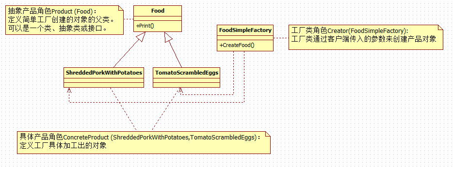

# When to use the Factory Design Pattern in real-time applications?
It would not be a good programming approach to specify the exact class name while creating the objects by the client which leads to tight coupling between the client and the product. To overcome this problem, we need to use the Factory Design Pattern in C#. This design pattern provides the client with a simple mechanism to create the object. So, we need to use the Factory Design Pattern in C# when

* The Object needs to be extended to the subclasses
* Classes don’t know what exact sub-classes it has to create
* The Product implementation going to change over time and the Client remains unchanged

# Problems of Simple Factory Pattern in C#
* If we need to add any new product (i.e. new credit card) then we need to add a new if else condition in the GetCreditCard method of the CreditCardFactory class. This violates the open/closed design principle.
* We also have a tight coupling between the Factory (CreditCardFactory) class and product classes (MoneyBack, Titanium, and Platinum).

看完简单工厂模式的实现之后，你和你的小伙伴们肯定会有这样的疑惑（因为我学习的时候也有）——这样我们只是把变化移到了工厂类中罢了，好像没有变化的问题，因为如果客户想吃其他菜时，此时我们还是需要修改工厂类中的方法（也就是多加case语句，没应用简单工厂模式之前，修改的是客户类）。我首先要说：你和你的小伙伴很对，这个就是简单工厂模式的缺点所在（这个缺点后面介绍的工厂方法可以很好地解决），然而，简单工厂模式与之前的实现也有它的优点：
# 优点
* 简单工厂模式解决了客户端直接依赖于具体对象的问题，客户端可以消除直接创建对象的责任，而仅仅是消费产品。简单工厂模式实现了对责任的分割。
* 简单工厂模式也起到了代码复用的作用，因为之前的实现（自己做饭的情况）中，换了一个人同样要去在自己的类中实现做菜的方法，然后有了简单工厂之后，去餐馆吃饭的所有人都不用那么麻烦了，只需要负责消费就可以了。此时简单工厂的烧菜方法就让所有客户共用了。（同时这点也是简单工厂方法的缺点——因为工厂类集中了所有产品创建逻辑，一旦不能正常工作，整个系统都会受到影响，也没什么不好理解的，就如事物都有两面性一样道理）

# 缺点

* 工厂类集中了所有产品创建逻辑，一旦不能正常工作，整个系统都会受到影响（通俗地意思就是：一旦餐馆没饭或者关门了，很多不愿意做饭的人就没饭吃了）
* 系统扩展困难，一旦添加新产品就不得不修改工厂逻辑，这样就会造成工厂逻辑过于复杂。

# 应用场景
* 当工厂类负责创建的对象比较少时可以考虑使用简单工厂模式
* 客户如果只知道传入工厂类的参数，对于如何创建对象的逻辑不关心时可以考虑使用简单工厂模式

