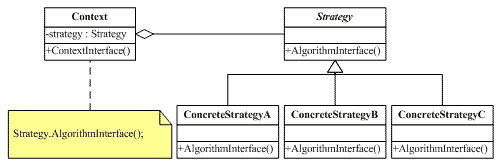

# What is the Strategy Design Pattern?
According to Gang of Four Definitions, define a family of algorithms, encapsulate each one, and make them interchangeable. Strategy lets the algorithm vary independently from clients that use it.

The Strategy Design Pattern is used when we have multiple algorithms (solutions) for a specific task and the client decides the actual implementation to be used at runtime.

# The Participant involved in the Strategy Design Pattern:
As already shown in the example, there are three participants involved in the Strategy Design Pattern. Their role and responsibility as follows:

* Strategy (ICompression): The Strategy declares an interface that is going to be implemented by all supported algorithms.
* ConcreteStrategy (RarCompression and ZipCompression): These are classes and they implement the algorithm defined by the Strategy (ICompression) interface.
* Context (CompressionContext): This is a class which maintains a reference to a Strategy object, and then uses that reference to call the algorithm defined by a particular ConcreteStrategy (i.e. either RarCompression or ZipCompression).